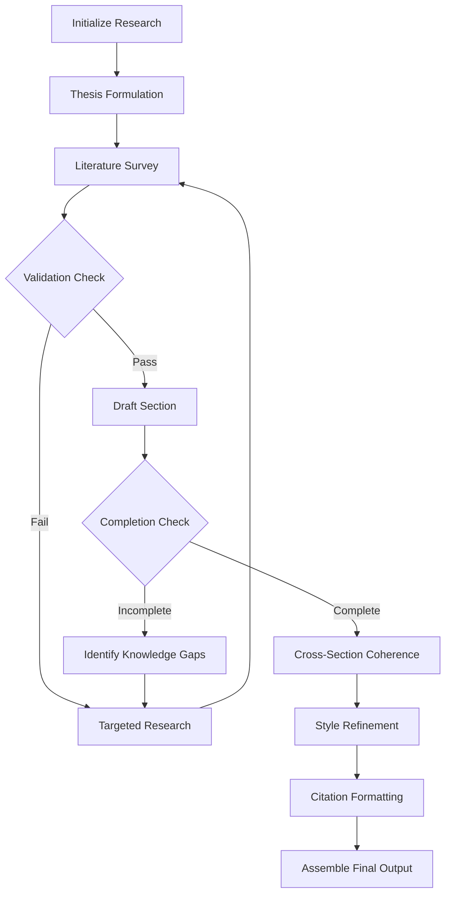

# AI Research Assistant

An AI-powered research assistant built with LangGraph that helps with academic research and paper writing.

## Overview

This project implements a comprehensive research workflow using LangGraph to create a structured, step-by-step process for conducting academic research and writing papers. The assistant can:

1. Formulate a thesis statement based on a research topic
2. Conduct a literature survey using web search
3. Validate the literature survey for sufficiency
4. Perform targeted research to address knowledge gaps
5. Draft sections of a research paper
6. Identify knowledge gaps in the research
7. Ensure cross-section coherence
8. Refine writing style and academic tone
9. Format citations according to academic standards
10. Assemble a complete research paper with proper citations

## Architecture

The project uses LangGraph to create a directed graph of research steps:



## Components

- **State Management**: Uses a `ResearchPaperState` class to track the research process
- **Configuration**: Configurable parameters for research limits, citation style, etc.
- **Web Search**: Integration with Tavily API for web research
- **LLM Integration**: Uses Ollama for local LLM inference
- **Prompt Templates**: Specialized prompts for each step of the research process
- **Conditional Routing**: Dynamic workflow based on validation results and completion status

## Getting Started

### Prerequisites

- Python 3.11+
- [Ollama](https://ollama.com/) for local LLM inference
- [Tavily API key](https://tavily.com/) for web search

### Quick Installation

1. Clone the repository:
```bash
git clone https://github.com/yourusername/ai-research-assistant.git
cd ai-research-assistant
```

2. Create a virtual environment:
```bash
python -m venv .venv
source .venv/bin/activate  # On Windows: .venv\Scripts\activate
```

3. Install dependencies:
```bash
pip install -e .
pip install langgraph-cli[inmem]
```

4. Set up environment variables:
```bash
# Create a .env file with your Tavily API key
cp .env.sample .env
# Edit the .env file with your API keys
```

> **Important**: Make sure your `.env` file is saved with UTF-8 encoding to avoid character encoding issues. See the [Setup Guide](SETUP_GUIDE.md) for detailed instructions.

5. Pull the required Ollama model:
```bash
ollama pull deepseek-r1:14b
```

### Running the Assistant

Use LangGraph CLI to run the assistant:

```bash
langgraph dev
```

For detailed setup instructions, troubleshooting, and configuration options, please refer to the [Setup Guide](SETUP_GUIDE.md).

## Usage

The assistant takes a research topic as input and guides you through the research process, producing a structured research paper as output.

### Research Workflow

1. **Initialize Research**: Set up the initial state with the research topic
2. **Thesis Formulation**: Generate a clear, focused thesis statement
3. **Literature Survey**: Gather and summarize relevant academic sources
4. **Validation Check**: Evaluate if the literature survey is sufficient
5. **Targeted Research**: Address gaps in the literature if needed
6. **Draft Section**: Write individual sections of the paper
7. **Completion Check**: Determine if all required sections are complete
8. **Identify Knowledge Gaps**: Find areas that need more research
9. **Cross-Section Coherence**: Ensure logical flow between sections
10. **Style Refinement**: Polish academic tone and writing quality
11. **Citation Formatting**: Format references according to citation style
12. **Assemble Final Output**: Compile the complete research paper

### API Access

When the LangGraph server is running, you can access:
- API documentation: http://127.0.0.1:2024/docs
- LangGraph Studio UI: https://smith.langchain.com/studio/?baseUrl=http://127.0.0.1:2024

## Implementation Details

### Key Files

- `src/assistant/graph.py`: Contains the LangGraph implementation with all nodes and edges
- `src/assistant/state.py`: Defines the state management for the research process
- `src/assistant/prompts.py`: Contains specialized prompts for each step
- `src/assistant/configuration.py`: Configurable parameters for the assistant
- `src/assistant/utils.py`: Utility functions for web search, source formatting, etc.

### Dependencies

The project uses the following key dependencies:
- `langgraph`: For creating the directed graph workflow
- `langchain-ollama`: For local LLM integration
- `tavily-python`: For web search capabilities
- `python-dotenv`: For environment variable management

## License

This project is licensed under the MIT License - see the LICENSE file for details.
